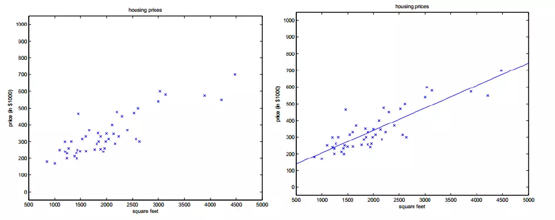
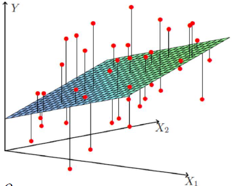
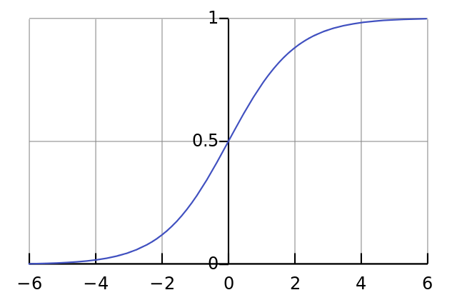

### Logistic回归与线性回归的区别

#### 线性回归

以单变量线性回归为例，我们希望找到自变量x与因变量之间存在的线性关系，并根据这种关系，预测未来输入对应的输出。
$$
h_\theta(x) = \theta_0 + \theta_1x
$$

得到参数${\theta_0,\theta_1}$ 的方法有很多，比如我们常见的随机梯度下降法。当我们有许多因变量共同影响因变量，(1)中的公式修改成如下形式：
$$
h_\theta(x) = \sum_{i=0}^{n}\theta_ix_i = \theta^Tx
$$

#### Logistic 回归

线性回归使用场景大多是回归预测，而Logistic回归使用场景则多是分类。我们先来看${Sigmoid}​$函数:
$$
 y = \frac{1}{1 + e ^{-z}}
$$
其函数曲线如下所示：

Sigmoid函数又称为Logistic函数，其值域在0和1之间，同时具有很好的对称性，也可用于神经网络激活函数。

${Logistic}$回归表示如下：
$$
z = \omega^T + b \\
y = \frac{1}{1 + e^{-z}} \\
y = \frac{1}{1 + e^{-(\omega^T + b)}}
$$

**可以看出，Logistic回归将线性回归的输出作为Sigmoid函数的输入，计算最终结果。其本质上是在用线性回归的预测结果去逼近真实标记的对数几率。，因此该模型称为“对数几率回归”。**

**虽然它的名字是“回归”，但是本质上是一种分类学习方法。这种方法有很多优点，无须事先假设数据分布，避免了假设分布不准确所带来的问题；它不是仅仅预测“类别”，而是得到近似概率预测。同时，对率函数是任意阶可导的凸函数，有很好的数学性质，现有的许多数值优化方法都可以直接用于求取最优解。**

